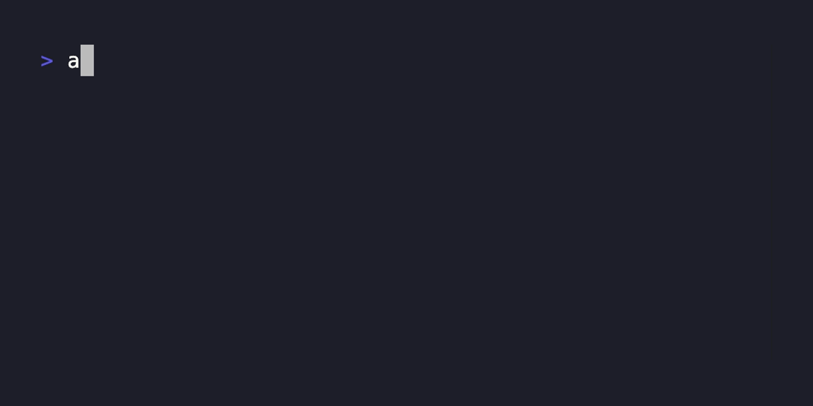

# AegisPass

[](https://pkg.go.dev/github.com/lucasloureiror/AegisPass/cmd/aegis)

[](https://goreportcard.com/report/github.com/lucasloureiror/AegisPass)


<p align="center">
  
</p>


AegisPass is a CLI tool designed for Software Engineers and DevOps Engineers/Site Reliability Engineers (SRE) to simplify the process of generating high quality random passwords across various platforms and operating systems. AegisPass uses cryptographically secure random numbers along with random.org to generate random passwords, providing enhanced security for your applications and services with to generate Randomness Mixing.

AegisPass is written in Go and is available for Linux, Windows, and macOS and it does not use anything out of the standard library and random.org, in the principle of no-trust.


## Documentation

You can check AegisPass official documentation [here](https://aegis.loureiro.tech) for more information about how to use AegisPass, why use AegisPass, how AegisPass works and more.

## Features

- Tailored for Software Engineers, DevOps Engineers, and SREs
- Generates true random passwords with randomness mixing
- Uses random.org and cryptographically secure random numbers to generate passwords
- Supports various platforms and operating systems
- Easy-to-use command line interface

## Prerequisites

- [Go](https://golang.org/doc/install) (version 1.18 or higher)

## Installation

[Homebrew](https://brew.sh) is one of the quickest ways to install AegisPass on macOS and Linux and you can stay up to date with the latest version.

```bash
brew install lucasloureiror/tools/aegis
```

To install AegisPass, you can use Go Install:

  ```bash
  go install github.com/lucasloureiror/AegisPass/cmd/aegis@latest
  ```

If you don't have $GOPATH/bin in your PATH for your shell, don't forget to add:

  ```bash
  export PATH=$PATH:$(go env GOPATH)/bin
  ```

You can also download the binary from the [releases page](www.github.com/lucasloureiror/AegisPass/releases) and add it to your PATH.

## Building the Project

If you want to build the AegisPass project, you can use the scripts inside the `/build` folder. Follow these steps:

1. Clone the repository:

```
git clone https://github.com/lucasloureiror/AegisPass.git
```

2. Change to the project directory:

```
cd AegisPass
```

3. Run the appropriate Makefile:

For Linux, Windows and macOS:

```
make build
```

This will compile the AegisPass project and create an executable binary in the `build/bin` folder called aegis.exe. Add to your path to use it globally.

## Usage

After installing AegisPass, you can use it to generate random passwords. The following examples show how to use AegisPass to generate random passwords with different lengths and options.


1. Running the AegisPass CLI tool:

Just run the executable with help to see the usage instructions:

```
aegis --help
```


The following help message will be displayed:

```
Usage: aegis [options] [password_length]

Arguments:
  password_length  The length of the password to be generated (default: 15)

Options:
  --bulk 		   Specify the number of passwords to be generated (default: 1)
  --numeric        Generate a numeric password
  --standard       Generate password with one upper case, one number and one special character at least.
  --online 	   	   Generate random or numeric passwords with random.org web service
  --credits        Print random.org web service credits to the user after generating a password
  --help           Print the help message to the user

Example:
  aegis --numeric 12
  aegis 8
  aegis --standard 10
  aegis --online 15
  aegis --online --credits 10
  aegis --help
```

## License

This project is licensed under the APACHE LICENSE v2 - see the [LICENSE](LICENSE) file for details.
